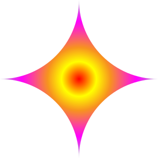
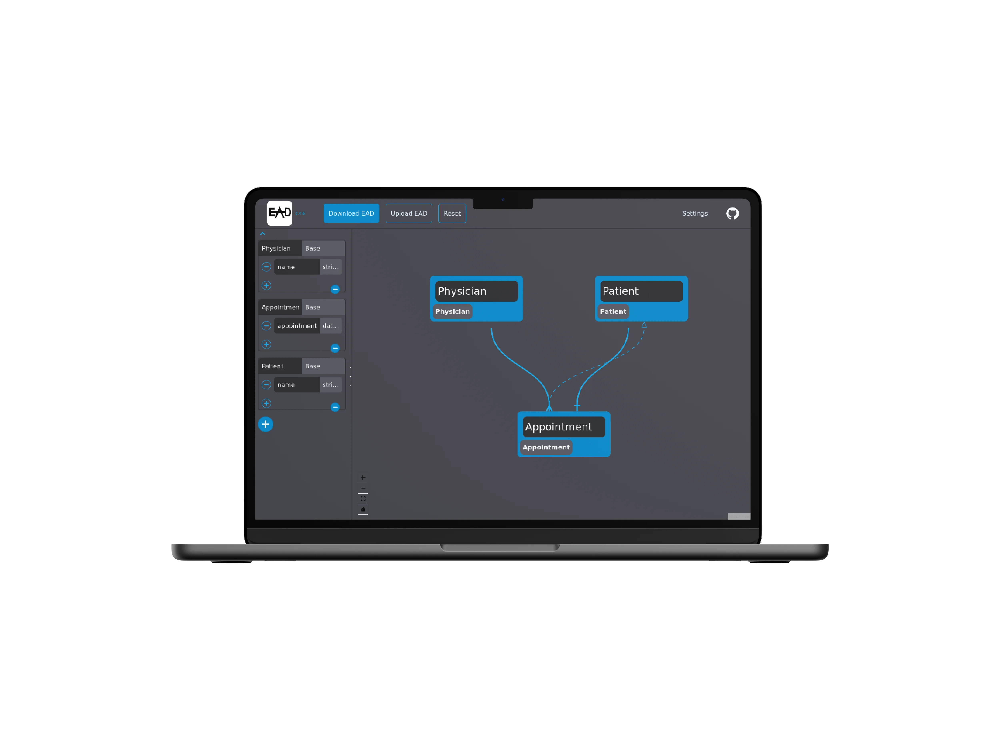
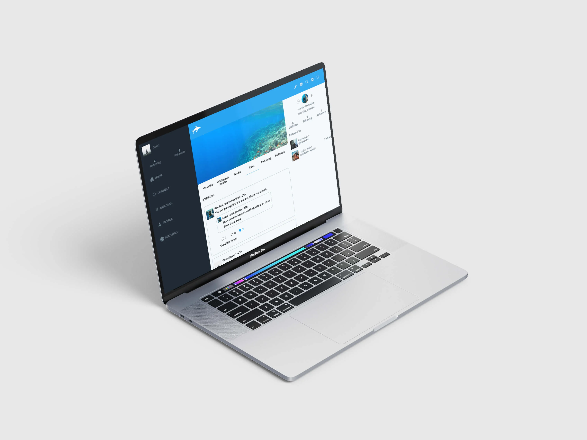

# Hi there, I'm Hasan 👋
### Full Stack Web Developer

## 🔧 Technologies & Tools

## 🚀 Featured Projects

  

    <h3 align="center">EAD</h3>
     
    

      
    

    

      
      
    

  

  

    <h3 align="center">Whistle</h3>
     
    

      
    

    

      
      
    

  

<!--
**ozovalihasan/ozovalihasan** is a ✨ _special_ ✨ repository because its `README.md` (this file) appears on your GitHub profile.

Here are some ideas to get you started:

- 🔭 I’m currently working on ...
- 🌱 I’m currently learning ...
- 👯 I’m looking to collaborate on ...
- 🤔 I’m looking for help with ...
- 💬 Ask me about ...
- 📫 How to reach me: ...
- 😄 Pronouns: ...
- ⚡ Fun fact: ...
-->
